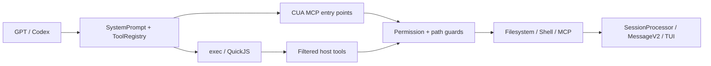

# MiMoCode 面向 GPT 模型的 Codex 微内核运行时

> “Codex 微内核运行时”是本文对当前架构的概括，不是源码中的正式模块名，也不表示操作系统级微内核。

## 摘要

MiMoCode 在共享 Session 引擎上运行 Codex harness，模型通过顶层 `exec` 在 QuickJS 中组合经过授权的宿主工具；CUA 的两个 MCP 入口保持顶层调用。`wait` 是预留的顶层工具名。权限、路径、子进程、取消、持久化和 UI 始终由宿主控制。

## 核心设计

MiMoCode 没有为 GPT 新建一套 Agent 引擎，而是在统一 Session runtime 上做三件事：

1. 使用 GPT/Codex 专属 system prompt，约定工具选择和调度方式；
2. 通过 `ToolRegistry` 装配更小的模型专属工具 ABI；
3. 提供 QuickJS `exec`，在不扩大权限的前提下组合宿主工具。

核心原则是：

> 模型决定做什么，`exec` 负责如何组合，宿主决定是否允许以及如何产生副作用。

## GPT 工具 ABI

[`usesGPTToolset()`](../../packages/opencode/src/tool/gpt.ts) 优先采纳显式会话 harness，再读取进程 Codex 开关和模型标识；自动识别包含 `gpt` 且不含 `gpt-oss` 的模型。

| GPT 可见工具 | 作用 |
| --- | --- |
| `exec` | 在 QuickJS 中批量调用和聚合宿主工具 |
| `cua_repl_js` / `cua_repl_js_reset` | 已授权时直接提供，保留 CUA 的持久运行时和多模态输出 |

GPT profile 会隐藏能力重叠的 `read`、`write`、`edit`、`multiedit`、`grep`、`glob` 和 `notebook_edit`。其他工具仍按 provider、agent allowlist 和运行时 permission 治理。

[`SystemPrompt.provider()`](../../packages/opencode/src/session/system.ts#L24) 独立选择 `gpt.txt`、`codex.txt` 或 `beast.txt`。Prompt 路由与工具 profile 目前是两套字符串规则，尚未统一成模型能力协商层。

## `exec` 微内核

[`ToolScriptTool`](../../packages/opencode/src/tool/tool-script.ts#L303) 对模型暴露为 `exec`。模型提交一个 TypeScript/JavaScript async function body，通过 `tools.<name>()` 调用宿主工具。

### 为什么不会绕过权限

[`tool-script-ref.ts`](../../packages/opencode/src/tool/tool-script-ref.ts#L1) 使用 late-bound registry，让 `exec` 取得和外层相同、已经过 model/agent 过滤的 `Tool.Def`：

- 外层不可见的 `read`、`write`、`edit` 不会在 `exec` 内重新出现；
- builtin 子调用执行原来的 `Tool.Def.execute()` 和 `Tool.Context`；
- MCP 子调用仍逐次执行 `ctx.ask()`；
- `exec_command` 只是 `bash` 的别名，权限和执行路径相同。

`exec`、`mcp_tool_search`、`invalid`、`workflow`、`session` 不可在脚本内调用；`task`、`actor`、`question`、`skill`、`cron` 等按授权结果提供。CUA 入口仅顶层调用。

### 子工具描述与输入约束

`Tool.Def → toolScriptCatalog → exec description / ALL_TOOLS` 是本地工具元数据的单一生成链路。每项包含 `name`、完整 `description` 和 `inputSchema`。参数通过 Zod 的输入视图生成 JSON Schema，保留字段说明、默认值、范围、字符串/数组约束与嵌套定义；具有默认值的入参仍可省略。

工具 schema 的统一序列化入口是 `Tool.jsonSchema()`：元数据查找经每个 schema 自身的 `meta()`，兼容 Desktop/plugin 独立打包的 Zod 实例；缺少该接口的 core schema 回落引擎 registry。普通请求、前缀快照、工具查询接口与 exec 共用此入口，不复制或修改全局 registry。

独立打包的 plugin 可同时传 `args` 与由定义方 Zod 构造的完整 `parameters`；引擎优先保留 parameters，并使用其 `toJSONSchema({io})`（若提供）。这让数值范围等内部表示随 Zod 版本变化时仍由定义方解释，而非由引擎旧版 Zod 重新解释。只提供 args 的 plugin 保持兼容。

`exec` description 同时提供简明 TypeScript 调用签名与完整 JSON 目录；JSON Schema 是参数语义的权威来源，不能只根据 TypeScript 类型推断约束。完整描述不受首行或长度截断。代价是提示词长度增加，不通过字段白名单省略约束。`exec_command` 使用自身参数 schema，而不是宿主 Bash 的入参。

QuickJS 内的 `ALL_TOOLS` 复用同一目录，并附请求已授权的 MCP 工具及其输入 schema；MCP schema 经 AI SDK 规范化读取，不再做字段投影。`$ref`、组合约束和扩展字段原样保留。目录不扩大授权面，CUA 及被排除工具不进入脚本目录。

### 两层安全边界

1. [`evalScript()`](../../packages/opencode/src/workflow/sandbox.ts#L106) 用 QuickJS 隔离 guest code，不提供 Node、`process`、`fetch`、timer 或模块加载；
2. 真正副作用仍由宿主工具执行，并经过 permission、external-directory、memory guard 和工具自身校验。

QuickJS 只隔离 `exec` 代码。`bash` 仍是真实 Shell，不是容器 sandbox。

### 资源限制

| 资源 | 默认值 / 上限 |
| --- | --- |
| 嵌套工具调用 | 默认 50，最高 500 |
| 并发调用 | 8 |
| 活跃计算 | 默认 60 秒，最高 600 秒 |
| Wall clock | 30 分钟 |
| Guest 内存 | 默认 64 MiB |
| 代码 / 返回值 / 日志 | 128 KiB / 256 KiB / 64 KiB |
| `files.*` 单文件 | 10 MiB |

`files.readText` 只能读取 worktree 或 OS tmp 内的 UTF-8 文本；`files.writeText` 只能写 OS tmp。项目变更必须调用受权限控制的宿主工具。

## 其他关键原语

### `apply_patch`

[`ApplyPatchTool`](../../packages/opencode/src/tool/apply_patch.ts#L24) 在写入前解析所有 hunks、检查路径、计算 diff 并请求 `edit` permission；写入后发布文件事件、运行格式化并刷新 LSP。

它会预验证全部 patch，但多文件写入不是事务性的，中途失败不会自动回滚已写文件。

### `view_image`

[`ViewImageTool`](../../packages/opencode/src/tool/view-image.ts#L23) 检查模型 image capability、external-directory 和 `read` permission，再验证图片格式并返回 data URL attachment。

当前限制：

- `detail` 只写入 metadata，不改变图片处理；
- 没有独立的图片大小限制；
- `exec` 只传递文本、metadata 和 JSON 值，不能透传图片 attachment，因此图片应直接调用 `view_image`。

## OpenAI Responses

OpenAI provider 通过 [`sdk.responses(modelID)`](../../packages/opencode/src/provider/provider.ts#L203) 发送请求。[`ProviderTransform.options()`](../../packages/opencode/src/provider/transform.ts#L1275) 默认设置 `store: false`，并为 GPT-5 reasoning 模型请求 `reasoning.encrypted_content`。

MiMoCode 将 provider metadata 写入消息并在下一轮回放，使无状态 Responses 工具循环可以继续推理；同时在发送前移除不可安全复用的 `itemId`，避免服务端或代理解析失效的 `rs_...` 引用。

[`CodexAuthPlugin`](../../packages/opencode/src/plugin/codex.ts#L364) 另行负责 ChatGPT Plus/Pro OAuth、token refresh、账户 header 和 Codex endpoint rewrite。它属于认证与传输层，不改变工具权限。

## PR 演化

[PR #1865](https://github.com/XiaomiMiMo/MiMo-Code/pull/1865) 是 stacked PR，base 指向 #1864 的 `feat/view-image-tool` 分支。它先完成：

- GPT 专属 Bash guidance；
- 隐藏重叠文件工具；
- 对齐 GPT/Claude 的 skill-search prompt 和 reminder。

[PR #1864](https://github.com/XiaomiMiMo/MiMo-Code/pull/1864) 随后继续加入 `view_image`、更完整的工具裁剪、`tool_script → exec`、GPT prompt、TUI 和 checkpoint 支持，最终整体合入 `main`。

当前 `skill_search` 仍向 GPT/Claude 暴露，但 system prompt 和 reminder 不主动要求它们搜索；这是 #1865 初始“隐藏工具”策略的后续调整。

## 当前缺口

- 模型分类依赖字符串启发式，Prompt 与工具 profile 规则可能漂移；
- `codex.txt` 仍提到 GPT profile 已隐藏的 Read/Edit/Write/Glob/Grep 工具；
- `view_image` 的暴露条件与执行期 image capability check 不完全一致；
- `files.readText` 依赖路径 jail，不执行普通 `read` permission ask；
- QuickJS 不能让 Bash 获得 OS 级隔离；
- [`registry-invocation-style.test.ts`](../../packages/opencode/test/tool/registry-invocation-style.test.ts#L17) 中 GPT `exec`、Bash description、`skill_search` 和 `multiedit` profile 用例目前被跳过。

## 关键源码

- [`session/system.ts`](../../packages/opencode/src/session/system.ts)：模型提示词路由；
- [`tool/registry.ts`](../../packages/opencode/src/tool/registry.ts)：GPT 工具 ABI；
- [`tool/tool-script.ts`](../../packages/opencode/src/tool/tool-script.ts)：`exec` 声明、dispatch、预算与结果；
- [`tool/tool-script-ref.ts`](../../packages/opencode/src/tool/tool-script-ref.ts)：同源工具过滤和控制流排除；
- [`workflow/sandbox.ts`](../../packages/opencode/src/workflow/sandbox.ts)：QuickJS sandbox；
- [`session/prompt.ts`](../../packages/opencode/src/session/prompt.ts)：工具执行上下文和 permission routing；
- [`provider/transform.ts`](../../packages/opencode/src/provider/transform.ts)：Responses reasoning round-trip。

### Shared tool execution lifecycle

SessionPrompt supplies a request-scoped builtin executor to exec. Both direct calls and nested calls run the same authorization, before/after hooks, attachment metadata and metrics handling. A nested call keeps its own metadata sink and call ID; permission requests bind to that child ID. Only model-facing calls enter the batch gate and signature deduplication: exec already holds that gate, and scripts own their ordering and error-catching semantics. Nested completion never attempts to complete a nonexistent standalone processor part. Standalone tool unit tests without a session executor retain direct Tool.Def execution.
